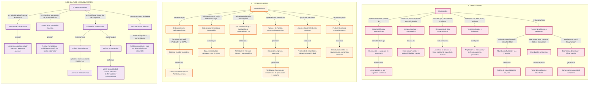

```mermaid
flowchart TD
    classDef librecambio fill:#fce4ec,stroke:#ad1457,stroke-width:2px,color:#2c3e50;
    classDef proteccionismo fill:#fff3e0,stroke:#e65100,stroke-width:2px,color:#2c3e50;
    classDef balance fill:#f3e5f5,stroke:#6a1b9a,stroke-width:2px,color:#2c3e50;

    subgraph S1 [1. LIBRE CAMBIO]
        direction TD
        LC[Librecambio]:::librecambio
        LC -->|se fundamenta en aportes de| EC[Escuela Clásica y Mercantilistas]:::librecambio
        EC -->|consideraban que| CS[El comercio es un juego de suma cero]:::librecambio
        CS -->|enfocado en| AO[Acumulación de oro y superávit comercial]:::librecambio

        LC -->|planteada por Adam Smith y David Ricardo| VAC[Ventaja Absoluta y Comparativa]:::librecambio
        VAC -->|basada en| ECP[Eficiencia en costos y productividad del trabajo]:::librecambio

        LC -->|criticado por David Hume mediante| MFE[Mecanismo de flujo especie-precio]:::librecambio
        MFE -->|que demuestra| APL[Aumento de precios a largo plazo ante superávits eternos]:::librecambio

        LC -->|defendido por John Stuart Mill con| VDI[Ventajas directas e indirectas]:::librecambio
        VDI -->|que logran| AMP[Ampliación de mercados y perfeccionamiento productivo]:::librecambio

        LC -->|evoluciona hacia| TNM[Teorías Neoclásicas y Modernas]:::librecambio
        TNM -->|explicado por el Modelo Heckscher-Ohlin| AFU[Abundancia factorial y uso intensivo]:::librecambio
        AFU -->|determina| PEP[Patrón de especialización del país]:::librecambio

        TNM -->|expresado en el Teorema Stolper-Samuelson| DI[Distribución del ingreso]:::librecambio
        DI -->|favoreciendo al| FPA[Factor de producción abundante]:::librecambio

        TNM -->|ampliado por Paul Krugman con| EED[Economías de escala y diferenciación]:::librecambio
        EED -->|generando| CIC[Comercio intra-industrial competitivo]:::librecambio
    end

    subgraph S2 [2. PROTECCIONISMO]
        direction TD
        PRO[Proteccionismo]:::proteccionismo
        PRO -->|sustentado por| EST[Estructuralismo Latinoamericano]:::proteccionismo
        EST -->|formulado por Raúl Prebisch y la CEPAL| SMA[Sistema mundial asimétrico]:::proteccionismo
        SMA -->|dividido en| CIP[Centro industrializado vs. Periferia primaria]:::proteccionismo

        PRO -->|respaldado por la Tesis Prebisch-Singer| DTI[Deterioro de términos de intercambio]:::proteccionismo
        DTI -->|causado por| BED[Baja elasticidad de demanda y ley de Engel]:::proteccionismo

        PRO -->|aplicado mediante la estrategia de| ISI[Industrialización por Sustitución de Importaciones ISI]:::proteccionismo
        ISI -->|orientada a| FMI[Fortalecer el mercado interno y gasto público]:::proteccionismo

        PRO -->|implementado a través de| RPC[Razones de Política Comercial y Aranceles]:::proteccionismo
        RPC -->|provocan| EPI[Elevación del precio importado]:::proteccionismo
        EPI -->|generando| PED[Pérdida de eficiencia por distorsiones de producción y consumo]:::proteccionismo

        PRO -->|justificado mediante| AIN[Argumento de la Industria Naciente]:::proteccionismo
        AIN -->|otorgando| PTP[Protección temporal para adquirir competitividad]:::proteccionismo

        PRO -->|impulsado por la| PCE[Política Comercial Estratégica PCE]:::proteccionismo
        PCE -->|buscando| SEI[Selectividad estatal en industrias con economías de escala]:::proteccionismo
    end

    subgraph S3 [3. EL BALANCE Y CONCLUSIONES]
        direction TD
        BAL[El Balance General]:::balance
        BAL -->|en relación a la eficiencia económica| VLB[Virtudes del Librecambio]:::balance
        VLB -->|permiten| LRM[Limitar monopolios, reducir precios y aumentar opciones]:::balance

        BAL -->|en relación a los riesgos del proteccionismo| CPE[Costos de la Protección Excesiva]:::balance
        CPE -->|generan| RMA[Rentas monopólicas artificiales y desvío del sector exportador]:::balance

        BAL -->|en función del desarrollo de los países| AES[Asimetrías Estructurales]:::balance
        AES -->|muestran que| PDES[Países desarrollados]:::balance
        PDES -->|aplicaron proteccionismo inicial y hoy| LDC[Lideran el libre comercio]:::balance

        AES -->|muestran que| PEN[Países en desarrollo]:::balance
        PEN -->|enfrentan| MPC[Menor productividad, costos laborales desfavorables y vulnerabilidad]:::balance

        BAL -->|como conclusión final exige| ARP[Articulación de políticas]:::balance
        ARP -->|uniendo la política comercial con| PIN[Políticas industriales para un desarrollo justo y sostenible]:::balance
    end
```
